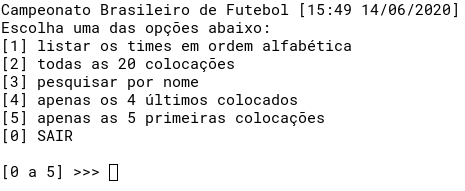

# Campeonato Brasileiro de Futebol (Serie A) [15:49 13/06/2020]

Programa que analisa um arquivo de texto com times classificados na Serie A do Brasileirao e retorna valores conforme escolhidos pelo usuario.

## Requerimentos:

- python3 (https://www.python.org/downloads/)

## Executar:

~$ cd src/ && python3 main.py

## Demonstracao:

